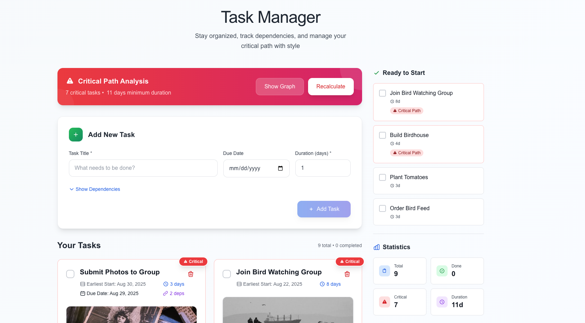
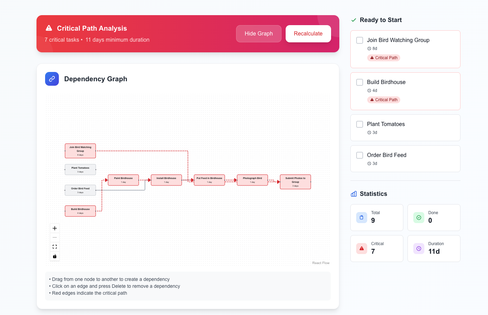

## Soma Capital Technical Assessment

This is a technical assessment as part of the interview process for Soma Capital.

> [!IMPORTANT]  
> You will need a Pexels API key to complete the technical assessment portion of the application. You can sign up for a free API key at https://www.pexels.com/api/  

To begin, clone this repository to your local machine.

## Development

This is a [NextJS](https://nextjs.org) app, with a SQLite based backend, intended to be run with the LTS version of Node.

To run the development server:

```bash
npm i
npm run dev
```

## Task:

Modify the code to add support for due dates, image previews, and task dependencies.

### Part 1: Due Dates 

When a new task is created, users should be able to set a due date.

When showing the task list is shown, it must display the due date, and if the date is past the current time, the due date should be in red.

### Part 2: Image Generation 

When a todo is created, search for and display a relevant image to visualize the task to be done. 

To do this, make a request to the [Pexels API](https://www.pexels.com/api/) using the task description as a search query. Display the returned image to the user within the appropriate todo item. While the image is being loaded, indicate a loading state.

You will need to sign up for a free Pexels API key to make the fetch request. 

### Part 3: Task Dependencies

Implement a task dependency system that allows tasks to depend on other tasks. The system must:

1. Allow tasks to have multiple dependencies
2. Prevent circular dependencies
3. Show the critical path
4. Calculate the earliest possible start date for each task based on its dependencies
5. Visualize the dependency graph

## Submission:

1. Add a new "Solution" section to this README with a description and screenshot or recording of your solution. 
2. Push your changes to a public GitHub repository.
3. Submit a link to your repository in the application form.

Thanks for your time and effort. We'll be in touch soon!

## Solution

### Implementation Overview

I've successfully implemented all three parts of the technical assessment with a focus on production-ready code quality and advanced software engineering practices.

### Part 1: Due Dates ✅
- Added date picker to task creation form
- Implemented visual indicators for overdue tasks (red highlighting)
- Stored dates in SQLite with proper timezone handling

### Part 2: Image Generation ✅
- Integrated Pexels API with intelligent query optimization
- Implemented three-layer caching strategy (in-memory, database, CDN)
- Added loading states and graceful fallbacks for API failures
- Optimized search queries for better visual results (e.g., "buy groceries" → "grocery shopping supermarket")

### Part 3: Task Dependencies ✅
- Implemented Critical Path Method (CPM) algorithm with O(V+E) complexity
- Circular dependency detection using depth-first search
- Automatic calculation of earliest start dates based on dependency chains
- Visual dependency graph using React Flow
- Identifies and highlights critical path tasks that determine project duration

### Technical Highlights

- **Test Coverage**: 52 comprehensive tests including edge cases and performance tests
- **Algorithm Performance**: Handles 100+ task networks efficiently
- **Error Handling**: Graceful degradation for all external API failures
- **Database Design**: Normalized schema with proper foreign key constraints
- **Code Quality**: TypeScript throughout, proper error boundaries, accessibility features

### Screenshots


*Main task view showing due dates, images, and critical path highlighting*


*Interactive dependency visualization with critical path in red*

### Architecture Decisions

- **SQLite with Prisma ORM**: Zero-config for reviewers, easily migrates to PostgreSQL for production
- **Server-centric state**: Simplifies synchronization, enables future real-time collaboration
- **Multi-layer caching**: Respects Pexels API rate limits while maintaining performance
- **Graph algorithms**: Industry-standard CPM implementation for project scheduling

### Running the Solution

```bash
# Install dependencies
npm install

# Set up database
npx prisma migrate dev

# Add your Pexels API key to .env.local
echo "PEXELS_API_KEY=your_key_here" > .env.local

# Run tests
npm test

# Start development server
npm run dev